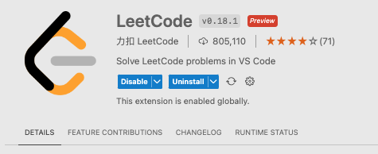
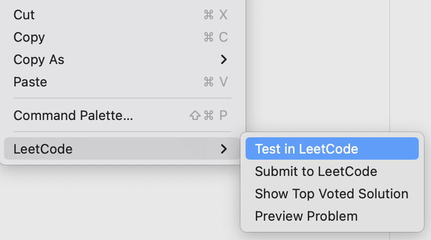

<!-- markdownlint-disable MD024 -->
<!-- markdownlint-disable MD045 -->

# Copilot Prompt Engineering

<p style="margin-left: 30px;">

This repository includes Copilot training exercises intended to give you practical experience using
 +

</p>

## 🎯 Goal

Learn of how to use prompt engineering techniques to get accurate responses from
 +


---

### Prompting Best Practices

- Provide references
  - Improve relevance of the response by providing an example and context
- Write clear instruction
  - Refine your prompt, provide context, write clearly, and give Copilot ample input for better results
- Split up big tasks
  - Breaking down complex tasks minimizes errors and utilizes previous outcomes for efficiency
- Allow GitHub Copilot time to think
  - Requesting Copilot’s thought process will enhance Copilot accuracy, but it may prolong wait times.
- Test changes systematically
  - Measure performance, watch for prompt changes' side effects, and use test suites for implementation

### Cornerstornes of Prompting

- Context :: Provide Examples
  - Information to help GitHub Copilot understand the task better
- Intent :: Give Directions
  - The specific goal or purpose you have in mind when creating a prompt
- Clarity :: Easy to Understand
  - Being clear, transparent, and easily understood
- Specificity :: Precision in Detail
  - Providing precise and detailed information, leaving little room for ambiguity or interpretation

### Techniques

- Zero-shot
- One-Shot
- Few-shot

---

## ✍️ Programming Languages

**Javascript**

---

## 💻 IDE

-  VS Code
-  Visual Studio
-  Jetbrains IDE

---

## 🗒️ Guide

### Prerequisites

- Copilot
- Copilot Chat

**Optional**
>Note: **DEMO 4** is an advanced demo that requires the use of the [VS-Code Leetcode extension](https://marketplace.visualstudio.com/items?itemName=LeetCode.vscode-leetcode)

---

### DEMO 1

#### Zero-shot

```text
Write me unit tests for all the operations in my calculator.js file
```

#### One-Shot

 ```text
 Write me unit tests for all the operations in my calculator.js file
Use the following example: test(‘adds 1 + 2 to equal 3’, () => ( expect(calculate(1, 2 ‘+’)).toBe(3); });
```

---

### DEMO 2

#### Zero-shot

```text
Can you create an HTML calculator for me?
```

#### One-Shot

```text
Can you create an HTML calculator for me? Use the following example:  
<!DOCTYPE html>
<html>
  <head>
    <title>Calculator</title>
    <link rel="stylesheet" href="style.css">
  </head>
<body>
</html> 
```

---

### DEMO 3

#### Zero-shot

```text
Can you write me the code for a snake game?
```

#### One-Shot

```text
Can you write me the code for a snake game? 
Example: Ensure that there is a leaderboard mechanic
```

---

### DEMO 4 - [LeetCode](https://leetcode.com) (Advanced Demo)

This demo uses a **very** detailed prompt with examples to guide Copilot in generating effective suggestions.

### Setup and detailed walkthrough with the <a href="https://marketplace.visualstudio.com/items?itemName=LeetCode.vscode-leetcode">LeetCode extension</a>
<p></summary>

#### 1. Install the <a href="https://marketplace.visualstudio.com/items?itemName=LeetCode.vscode-leetcode">LeetCode extension</a> in VS-Code

   

#### 2. Log into the LeetCode website

 <p style="margin-left: 30px;">2.1 &nbsp; &nbsp;At the time of writing this document, the LeetCode extension may experience difficulties with logging in to leetcode.com. For guidance on connecting to the website, please refer to the instructions provided in this <a href="https://betterprogramming.pub/work-on-leetcode-problems-in-vs-code-5fedf1a06ca1">blog</a>.</p>

#### 3. When you are connected to `leetcode.com`, start with some exercise

<p style="margin-left: 30px;">1. Open the `leetcode` extension
</p>
<p style="margin-left: 30px;">2. Select a problem to solve.
</p>
<p style="margin-left: 30px;">3. Start the coding exercise.
</p>
<p style="margin-left: 30px;"><b>NOTE:</b> before <b>leetcode</b> opens a solution file, it will ask for some info:
</p>
<p style="margin-left: 30px;">We recommend to use the following options:

- `Select an implementation language` (your choice)

- `Just open the problem file` (opens a new tab)

</p>

<p style="margin-left: 30px;"></p>

#### 4. Now use the problem descption from **leetcode** with Copilot Chat (copy & paste), ask it to create the code

#### 5. When you accepted the suggestion from copilot chat (copy into file)
Use the right click pop-up menu in the solutions file to `test` and `submit` your solution to **leetcode**

<p style="margin-left: 30px;"></p>

---

#### The final step is to evaluate the Copilot suggestion for its 'pass' or 'fail' status and to determin its corresponding 'score'

#### Good Luck

## 🤝 Contributing

Contributions are warmly welcomed! ✨

To contribute to a public exercise, please refer to our contribution guidelines [here](https://github.com/ps-copilot-sandbox/.github/blob/main/.github/CONTRIBUTING.md).

To create a net new exercise, please use [this repository template](https://github.com/ps-copilot-sandbox/copilot-exercise-template).
